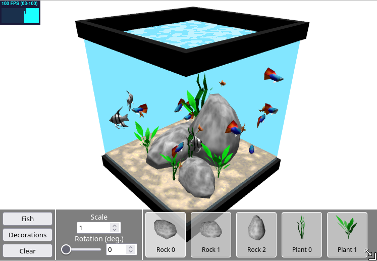

# Maya's Aquarium Maker 3D

### [Visit the live version!](https://aquarium3d.may.as)

A virtual fish tank made in three.js using react-three-fiber. Started from the [vite typescript react template](https://vite.dev/).

```sh
npm install
npm run dev
```

The goal for this is to have an editor where you can make a fish tank, and then create an embed you can put on your website.



## Roadmap

- [x] add static props / plants
- [x] collisions
- [x] multiple types of fish
- [x] add animations to fish models
- [x] better water shader
- [ ] bubble particles from plants
- [x] editor
- [x] undo/redo in editor
- [ ] delete objects in editor
- [ ] prevent editor objects from clipping into tank
- [ ] allow placement of objects on top of one another
- [x] embed with settings in url
- [ ] customize color of fish/props?
- [ ] click to feed fish
- [ ] more shapes of fish tank
- [ ] non-fish creatures (shrimps? snails?)
- [ ] instance meshes?
